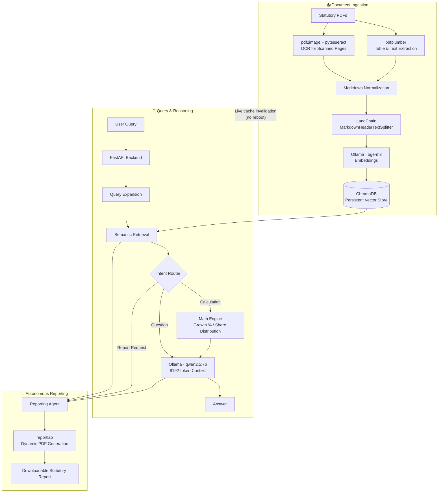

<div align="center">

# ⛏️ MineX

### Air-Gapped Agentic RAG for Statutory Document Intelligence

*A sovereign, 100% offline document intelligence engine built for the Ministry of Coal.*

[](https://www.python.org/)
[](https://fastapi.tiangolo.com/)
[](https://ollama.com/)
[](https://www.trychroma.com/)
[](https://www.langchain.com/)
[](#-air-gapped-security-architecture)
[](https://www.sih.gov.in/)

</div>

---

## 📑 Table of Contents

- [Overview](#-overview)
- [Key Features](#-key-features)
- [Air-Gapped Security Architecture](#-air-gapped-security-architecture)
- [System Architecture](#-system-architecture)
- [Tech Stack](#-tech-stack)
- [Getting Started](#-getting-started)
  - [Prerequisites](#prerequisites)
  - [Installation](#installation)
  - [Running the Server](#running-the-server)
- [Troubleshooting](#-troubleshooting)
- [Roadmap](#-roadmap)
- [Team & Acknowledgements](#-team--acknowledgements)
- [License](#-license)

---

## 🔭 Overview

**MineX** is a secure, local-first **Agentic Retrieval-Augmented Generation (RAG)** platform that serves as a document intelligence engine for the **Ministry of Coal**. It was developed for the **Smart India Hackathon (SIH) 2026**.

Statutory coal-sector documents are dense, table-heavy PDFs: production rates, dispatch figures, and safety metrics sit side by side in complex layouts. MineX ingests these documents, extracts the raw tabular data with layout awareness, and lets officials interrogate them in natural language. An autonomous reporting agent can then synthesize the retrieved context into a formally structured, downloadable PDF statutory report.

Because the Ministry handles sensitive data, **nothing leaves the machine**. LLM inference, vector embedding, and document parsing all run locally, with zero external API calls.

---

## ✨ Key Features

| # | Feature | Description |
|---|---------|-------------|
| 1 | **Air-Gapped & Sovereign** | Zero external API calls. The full pipeline runs offline for complete data privacy and data sovereignty. |
| 2 | **Semantic Tabular Retrieval** | An 8192-token context window combined with query expansion maps terms such as `"Dec 25"` or `"Mill Te"` to the correct production figures, without confusing them with safety incident rates. |
| 3 | **Agentic Math Capabilities** | Built-in calculation routing computes percentage growth and share distribution directly from the extracted raw coal data, rather than relying on the LLM's arithmetic. |
| 4 | **Autonomous PDF Reporting** | Generates formatted executive dossiers, as downloadable PDFs, from user queries and retrieved context. |
| 5 | **Live Cache Invalidation** | Newly ingested documents update the vector index instantly. No server reboot required. |

---

## 🔒 Air-Gapped Security Architecture

MineX is engineered for environments where data cannot, under any circumstance, leave the local machine.

- **No cloud dependencies.** LLM inference (`qwen2.5:7b`), embeddings (`bge-m3`), OCR, and PDF generation are all executed locally.
- **WDAC-compatible by design.** Enterprise **Windows Defender Application Control (WDAC)** policies commonly block unsigned native libraries, which includes the heavy C++ tensor DLLs shipped with local PyTorch installations. MineX avoids this entirely by routing all tensor operations (generation *and* embedding) through **Ollama**, so no PyTorch DLLs are loaded into the Python process.
- **Local persistence.** All vectors and metadata live in a local, persistent ChromaDB store on disk.

> **Result:** a full RAG stack that installs and runs on locked-down government workstations, with no outbound network path required at runtime.

---

## 🏗️ System Architecture



**Flow summary**

1. **Ingest:** PDFs are parsed with `pdfplumber` (tables preserved) with an OCR fallback for scanned pages, normalized to Markdown, and split along header boundaries so tables stay intact within their section context.
2. **Embed & Store:** Chunks are embedded locally with `bge-m3` via Ollama and persisted to ChromaDB. Ingesting a new document invalidates the live index cache immediately.
3. **Retrieve:** User queries are expanded, then matched semantically against the store to surface the correct tabular context.
4. **Reason:** An intent router sends calculation requests through the math engine, and passes everything to `qwen2.5:7b` for grounded answer synthesis.
5. **Report:** The reporting agent compiles retrieved context and computed figures into a formatted PDF dossier using `reportlab`.

---

## 🧰 Tech Stack

| Layer | Technology |
|-------|------------|
| **Backend Framework** | FastAPI (Python) served with Uvicorn |
| **LLM Engine** | Ollama running `qwen2.5:7b` (4-bit quantized for local GPU execution) |
| **Embeddings** | Ollama running `bge-m3` (efficient multilingual embedding model) |
| **Vector Database** | ChromaDB (local persistent storage) |
| **Orchestration & RAG** | LangChain (`MarkdownHeaderTextSplitter`, Query Expansion) |
| **Document Ingestion** | `pdfplumber` (complex table extraction), `pdf2image`, `pytesseract` (OCR) |
| **Report Generation** | `reportlab` (dynamic PDF creation) |

---

## 🚀 Getting Started

### Prerequisites

| Requirement | Notes |
|-------------|-------|
| **Python 3.10+** | With `venv` support. |
| **[Ollama](https://ollama.com/download)** | Local model runtime for both the LLM and the embedding model. |
| **NVIDIA GPU (recommended)** | For local execution of the 4-bit quantized `qwen2.5:7b` model. |
| **[Tesseract OCR](https://github.com/tesseract-ocr/tesseract)** | Required by `pytesseract` for scanned pages. |
| **[Poppler](https://github.com/oschwartz10612/poppler-windows/releases)** | Required by `pdf2image` on Windows. Add its `bin` folder to `PATH`. |

> ⚠️ **Windows users — directory placement matters.**
> Place the project in the root of the `C:\` drive (e.g. `C:\MineX`). Cloning into a user profile or `Documents`/`Desktop` folder can trigger **OneDrive sync conflicts** (locked or partially synced vector store files) and **WDAC blocks** on locally executed binaries.

### Installation

**1. Pull the local models** (Ollama must be installed and running):

```bash
ollama pull qwen2.5
ollama pull bge-m3
```

**2. Clone the repository** (Windows: into the `C:\` root):

```bash
cd C:\
git clone https://github.com/Faizshaikh77723/MineX.git
cd MineX
```

**3. Create and activate a virtual environment:**

```bash
# Windows (PowerShell)
python -m venv venv
.\venv\Scripts\Activate.ps1

# macOS / Linux
python3 -m venv venv
source venv/bin/activate
```

**4. Install dependencies:**

```bash
pip install -r requirements.txt
```

### Running the Server

```bash
uvicorn backend.main:app --port 8000
```

Once running, the service is available at **http://localhost:8000**, with interactive API docs at **http://localhost:8000/docs** (FastAPI's built-in Swagger UI).

> 💡 To verify the air-gapped guarantee, disconnect the machine from the network before launching. The full pipeline should operate without any degradation.

---

## 🛠️ Troubleshooting

| Symptom | Likely Cause | Resolution |
|---------|--------------|------------|
| Connection errors to the model backend | Ollama service is not running | Start Ollama, then confirm with `ollama list` that both `qwen2.5` and `bge-m3` are present. |
| Blocked DLL / policy errors on launch | Project is in a WDAC-restricted location | Move the project to `C:\MineX` and recreate the virtual environment. |
| Vector store file lock or sync errors | OneDrive is syncing the project folder | Relocate the project outside any OneDrive-managed path. |
| OCR or image-conversion failures | Tesseract or Poppler missing from `PATH` | Install both and restart the terminal. |

---

## 🗺️ Roadmap

- [ ] Role-based access control for multi-user deployments
- [ ] Audit logging for queries and generated reports
- [ ] Batch ingestion of document archives
- [ ] Expanded report templates for additional statutory formats

---

## 🤝 Team & Acknowledgements

Built for the **Smart India Hackathon 2026** in collaboration with the **Ministry of Coal**, Government of India.

| Name | Role |
|------|------|
| _Shaikh Mohammad Faiz_ | _AI/ML(Leader)_ |
| _Siddiqui Yasar_ | _Backend Developer_ |
| _Aarush Gandhi_ | _Frontend Developer_ |
| _Yukti Patel_ | _Research Analyst_ |
| _Yatri Prajapati_ | _Data Analyst_ |
| _Pranav Raval_ | _Database Manager_ |

---

## 📄 License

Distributed under the **MIT License**. See [`LICENSE`](LICENSE) for details. *(Update this section to match your chosen license.)*

---

<div align="center">

**MineX** · Sovereign document intelligence, entirely on your machine.

</div>
